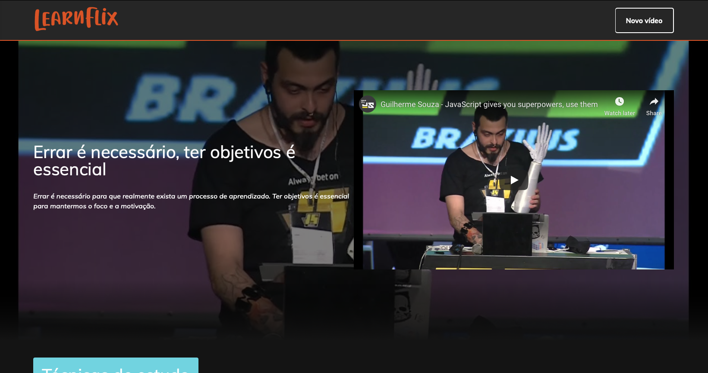
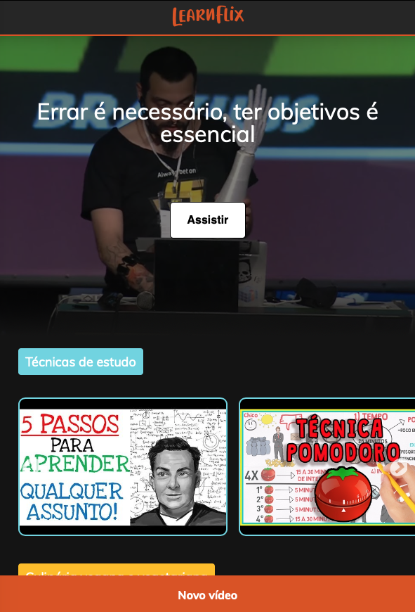

<meta charset="utf-8">
<h1 align="center">
    
</h1>

<h4 align="center">
  Imersão React - Alura
</h4>

 

  

  

  
  

  <a href="#rocket-tecnologias">Tecnologias</a>&nbsp;&nbsp;&nbsp;|&nbsp;&nbsp;&nbsp;
  <a href="#-projeto">Projeto</a>&nbsp;&nbsp;&nbsp;|&nbsp;&nbsp;&nbsp;
  <a href="#-layout">Layout</a>&nbsp;&nbsp;&nbsp;|&nbsp;&nbsp;&nbsp;
  <a href="#-como-contribuir">Como contribuir</a>&nbsp;&nbsp;&nbsp;|&nbsp;&nbsp;&nbsp;
  <a href="#memo-licença">Licença</a>

 

## ⚙️ Tecnologias

Esse projeto foi desenvolvido com as seguintes tecnologias:

- [JavaScript](https://developer.mozilla.org/pt-BR/docs/Web/JavaScript)
- [React](hhttps://pt-br.reactjs.org)
- [CSS](https://cssreference.io/)

## 💻 Projeto

O Proffy é uma plataforma de estudos online que visa facilitar a busca de professores online, bem como o cadastro deles para oferta de aulas.
<!-- 
<h3 style="display: inline">Preview</h3><strong> - Aplicações web e mobile</strong>

  

  

 -->

## 🔖 Layout

O layout desse projeto foi desenvolvido durante a imersão React da Alura

## 📖 Como contribuir

- Faça um fork desse repositório;
- Cria uma branch com a sua feature: `git checkout -b minha-feature`;
- Faça commit das suas alterações: `git commit -m 'feat: Minha nova feature'`;
- Faça push para a sua branch: `git push origin minha-feature`.

Depois que o merge da sua pull request for feito, você pode deletar a sua branch.

## 📝 Licença

Esse projeto está sob a licença MIT. Veja o arquivo [LICENSE](LICENSE.md) para mais detalhes.

---

Feito com 💛 por <strong> Viviane Queiroz 🦋 </strong> 

